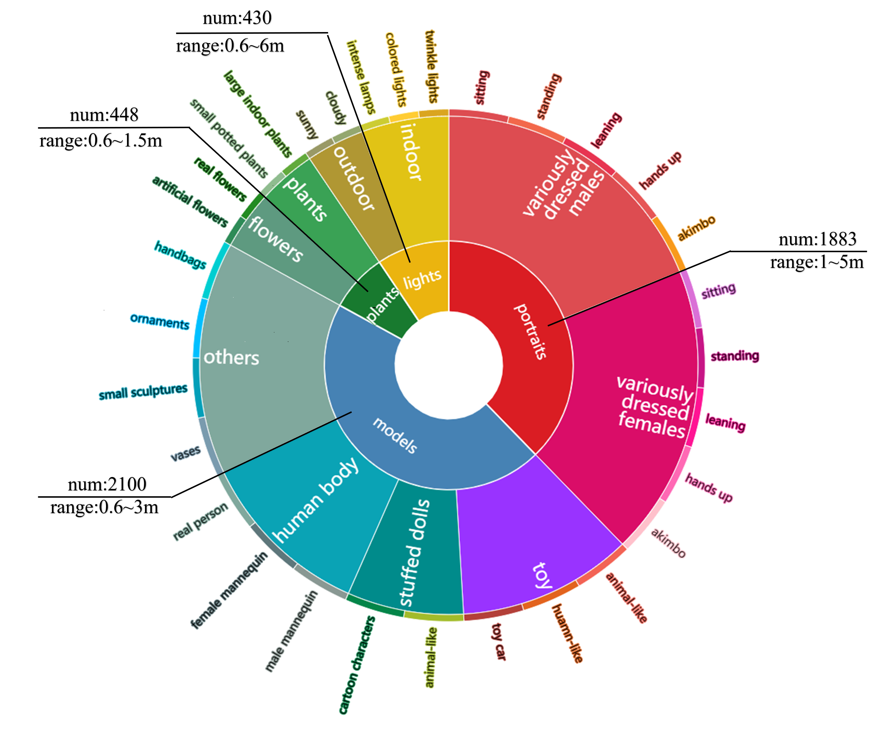
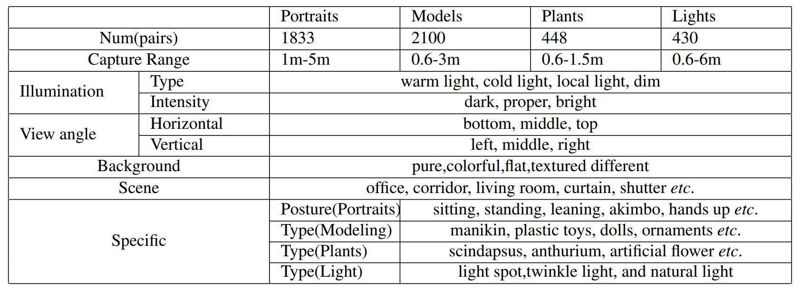
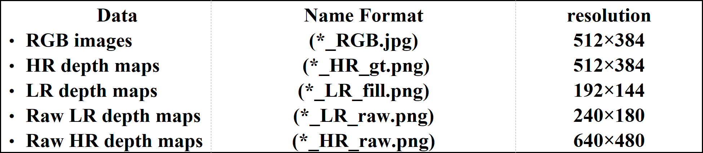
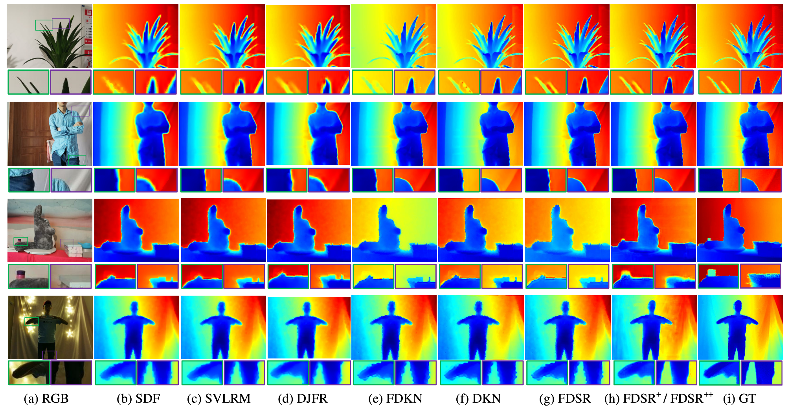

# RGB-D-D Dataset

Official RGB-D-D Dataset introduction of "Towards Fast and Accurate Real-World Depth Super-Resolution: Benchmark Dataset and Baseline. He et al. @CVPR 2021." [arxiv](https://arxiv.org/abs/2104.06174) 

## Overview
The RGB-D-D (RGB-depth-depth) dataset contains 4811 paired samples ranging from indoor scenes to challenging outdoor scenes. The "D-D" means the paired LR and HR depth maps captured from the mobile phone (LR sensors) and Lucid Helios (HR sensors), respectively. The RGB-D-D can not only meet the real scenes and real correspondences for depth map SR, but also support the extension of other depth-related tasks, such as hole filling, denoising, etc. More information can be found in our paper.

## RGB-D-D Dataset
The HR and LR depth maps are all captured by Time of Flight sensors to guarantee the same magnitude of depth value as possible. Considering the application scenarios and acquisition capabilities of real low-power LR sensor (the depth camera on phone, etc.), we guarantee little missing values of LR depth maps to avoid the impact of uncaptured original depth map SR task. The RGB-D-D dataset is divided into four main categories:


Fig 1. The scenes and corresponding hierarchical content structure of RGB-D-D. The inner ring represents the classification of scenes. The legends express the number of samples and the depth range of corresponding subsets.



Table 1. Subset categories and content for RGB-D-D

## File Naming Conventions and Formats:



## Split
We randomly split 1586 portraits, 380 plants, 249 models for training and 297 portraits, 68 plants, 40 models for testing. The remaining model samples are not used in training and testing to avoid content repetition. What's more, the 430 pairs of lights data are all used to test when evaluating methods in more challenge scenes. The detailed content of split can be found in our dataset files.

## Experiments


Fig 2. Visual comparison of × 8 depth map SR results on RGB-D-D. The first two and last two rows are the results of FDSR+ and FDSR++ respectively (a) RGB images. (b) SDF. (c) SVLRM. (d) DJFR. (e) FDKN. (f) DKN. (g) FDSR (trained on NYU v2). (h) FDSR+ / FDSR++ (Trained in downsampling manner / Trained in real-world manner on RGB-D-D). (i) GT.

## Demo
Please refer to the webset of our team for additional information: [Mepro](http://mepro.bjtu.edu.cn/resource.html) 

## Copyright
The RGB-D-D dataset is available for the academic purpose only. Any researcher who uses the RGB-D-D dataset should obey the licence as below:

This dataset is for non-commercial use only. All of the RGB-D-D Dataset are copyright by MePro, Center of Digital Media Information Processing, BJTU. This means that you must attribute the work in the manner specified by the authors, you may not use this work for commercial purposes and if you alter, transform, or build upon this work, you may distribute the resulting work only under the same license. If you find yourself or your personal belongings in the data, please contact us, and we will immediately remove the respective images from our servers.

## Download
Because the RGB-D-D contains a lot of personal information of the collectors, and the RGB-D-D dataset is available for the academic purpose only. So please download the [Release Agreement](doc/ReleaseAgreement.pdf), read it carefully, and complete it appropriately. Note that the agreement needs a handwritten signature by a full-time staff member (that is mean student is not acceptable). We will only take applications from organization email (please DO NOT use the emails from gmail/163/qq). Anyone who uses the RGB-D-D dataset should obey the agreement and send us an email for registration. Please scan the signed agreement and send it to Mepro_BJTU@hotmail.com. Then we will verify your request and contact you on how to download the data.

## Citation
If you use our dataset, please cite:
```
@article{he2021towards,
  title={Towards Fast and Accurate Real-World Depth Super-Resolution: Benchmark Dataset and Baseline},
  author={He, Lingzhi and Zhu, Hongguang and Li, Feng and Bai, Huihui and Cong, Runmin and Zhang, Chunjie and Lin, Chunyu and Liu, Meiqin and Zhao, Yao},
  journal={arXiv preprint arXiv:2104.06174},
  year={2021}
}
```

## Acknowledgement

This work was supported by the National Key Research and Development of China (No. 2018AAA0102100), the National Natural Science Foundation of China (No. U1936212, 61972028), the Beijing Natural Science Foundation (No. JQ20022), the Beijing Nova Program under Grant (No. Z201100006820016) and the CAAI-Huawei MindSpore Open Fund.
